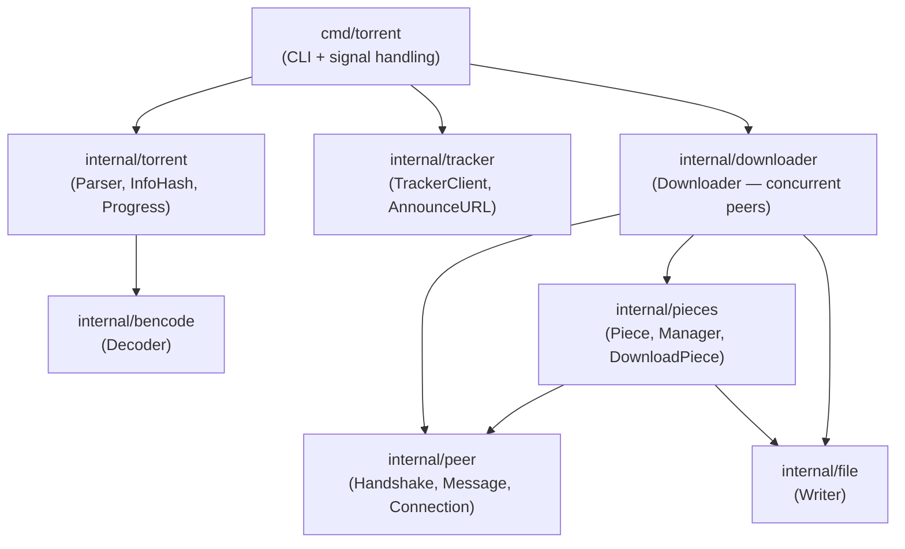
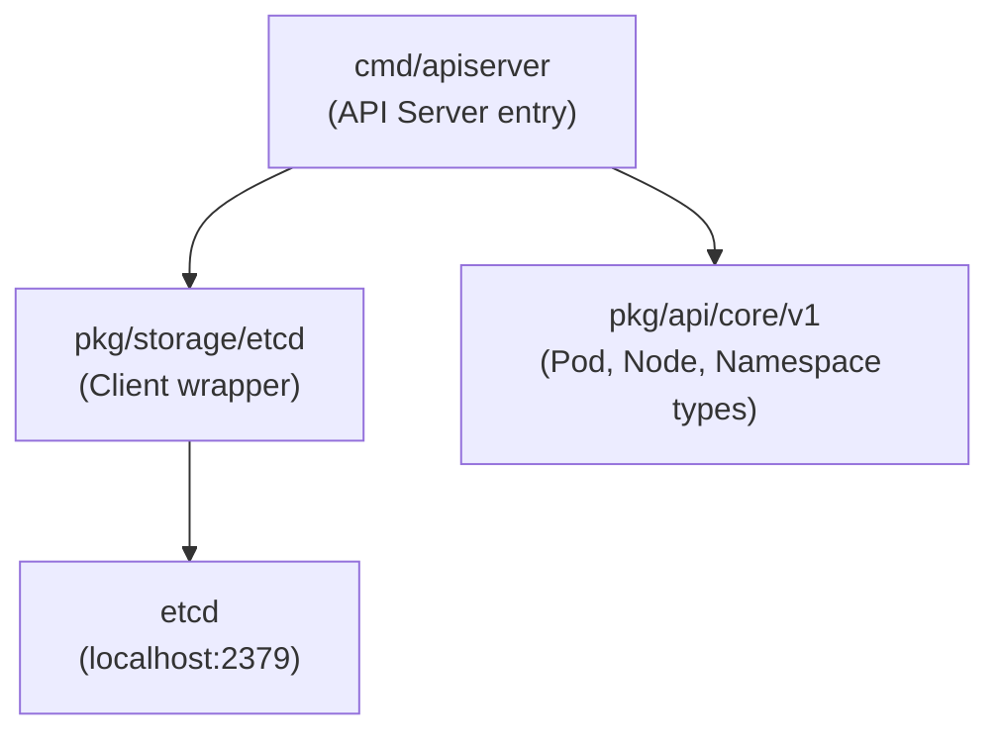

<!-- generated-by: gsd-doc-writer -->
# Architecture

## System Overview

`go-cook` is a Go learning monorepo housing several independent projects and exercises at different stages of development. It is not a single deployable application; instead, each top-level subdirectory is a self-contained Go module or exercise set. The repository spans a root-level HTTP server experiment, a from-scratch BitTorrent client (`learn-you-a-torrent`), a Kubernetes-style container orchestration prototype (`design-kube`), a standalone first-Go-application exercise, and a collection of algorithmic coding-problem solutions organized by technique. The architectural style varies per project: `learn-you-a-torrent` is a layered pipeline with concurrent peer workers; `design-kube` is a control-plane API server backed by etcd; the root server is a minimal HTTP handler.

## Component Diagram

```
go-cook/
├── main.go                    ← Root HTTP server (gorilla/mux, :8080)
├── first-go-application/      ← Language basics exercise (stdlib only)
├── coding-problems/           ← Algorithm exercises by technique
│   ├── arrays-and-strings/
│   ├── linked-lists/
│   ├── hash-map-set/
│   ├── graphs/
│   ├── prefix-sum/
│   ├── queues/
│   ├── sliding-window/
│   ├── stacks/
│   └── two-pointers/
├── learn-you-a-torrent/       ← BitTorrent client (Go module)
│   └── cmd/torrent/           ← CLI entry point
│       ├── internal/bencode/  ← Bencode decoder
│       ├── internal/torrent/  ← .torrent parser, info hash
│       ├── internal/tracker/  ← HTTP tracker announce
│       ├── internal/peer/     ← Wire protocol (BEP 3)
│       ├── internal/pieces/   ← Block assembly + SHA1 verify
│       ├── internal/downloader/ ← Concurrent peer coordinator
│       └── internal/file/     ← Disk writer
└── design-kube/               ← Kubernetes-style orchestrator (Go module)
    ├── cmd/apiserver/         ← API server entry point
    └── pkg/
        ├── api/core/v1/       ← Resource type definitions
        └── storage/etcd/      ← etcd client wrapper
```

### learn-you-a-torrent data flow (Mermaid)



### design-kube data flow (Mermaid)



## Data Flow

### Root HTTP server

A single `gorilla/mux` router matches `/{text}` and renders `static/text.html` with the captured path variable as template data. Listens on `:8080`.

### learn-you-a-torrent download pipeline

1. `cmd/torrent/main.go` receives `download <file.torrent>` from the CLI and sets up OS signal handling for graceful shutdown via `context.WithCancel`.
2. `torrent.ParseTorrent` reads the `.torrent` file, calls `bencode.Decoder` to parse the bencode structure, extracts `Info` and computes the `InfoHash` (SHA1 of the raw bencoded info dict).
3. `tracker.Client.Announce` builds an HTTP GET announce URL, calls the tracker, decodes the compact peer list (`ParseCompactPeers`), and returns `[]Peer{IP, Port}`.
4. `downloader.Downloader.Download` opens a `file.Writer` targeting the output directory, creates a `pieces.Manager` tracking which pieces remain, then spawns one goroutine per peer.
5. Each peer goroutine dials TCP, performs the 68-byte BitTorrent handshake via `peer.ExchangeHandshake`, sends unchoke/interested messages (`pieces.PrepareForDownload`), then loops calling `pieces.DownloadPiece` — requesting 16 KB blocks, assembling them into a `Piece`, SHA1-validating with `Piece.Validate`, and writing to disk with `file.Writer.WritePiece`.
6. `pieces.Manager.MarkComplete` records each verified piece. When `Manager.Complete()` returns true, `writer.Close()` flushes the file and the CLI prints the completion message.

### design-kube API server

The `cmd/apiserver/main.go` entry point connects to a local etcd instance at `localhost:2379` via `pkg/storage/etcd.NewClient`, performs a round-trip `Put`/`Get` smoke test, and prints the result. The `pkg/api/core/v1` package defines the resource types (`Pod`, `Node`, `Namespace`) that the control plane will eventually manage. The `pkg/storage/etcd` key package defines the hierarchical key scheme (`/registry/{group}/{version}/{resource}/{namespace}/{name}`) used to store resources in etcd.

## Key Abstractions

| Abstraction | File | Description |
|---|---|---|
| `torrent.Torrent` | `learn-you-a-torrent/internal/torrent/torrent.go` | Parsed `.torrent` metadata including `Info` and `InfoHash` |
| `torrent.Info` | `learn-you-a-torrent/internal/torrent/torrent.go` | Piece length, total length, SHA1 hashes per piece, and file name |
| `bencode.Decoder` | `learn-you-a-torrent/internal/bencode/decode.go` | Hand-rolled bencode parser (no external library) |
| `tracker.Client` | `learn-you-a-torrent/internal/tracker/client.go` | HTTP tracker announce and compact peer decoding |
| `peer.Connection` | `learn-you-a-torrent/internal/peer/connection.go` | Wraps a TCP conn; drives handshake and message framing |
| `peer.Handshake` | `learn-you-a-torrent/internal/peer/handshake.go` | Serializes/deserializes the 68-byte BEP 3 handshake |
| `peer.Message` | `learn-you-a-torrent/internal/peer/message.go` | Reads and writes length-prefixed wire messages |
| `pieces.Piece` | `learn-you-a-torrent/internal/pieces/piece.go` | Holds block data, tracks completeness, validates SHA1 |
| `pieces.Manager` | `learn-you-a-torrent/internal/pieces/manager.go` | Thread-safe tracker of missing vs. completed pieces |
| `downloader.Downloader` | `learn-you-a-torrent/internal/downloader/download.go` | Coordinates concurrent peer goroutines; owns progress reporting |
| `file.Writer` | `learn-you-a-torrent/internal/file/writer.go` | Maps piece index to byte offset; writes to a single output file |
| `etcd.Client` | `design-kube/pkg/storage/etcd/client.go` | Thin wrapper over `go.etcd.io/etcd/client/v3` exposing Get/Put/Delete/Watch/Txn |
| `v1.Pod`, `v1.Node`, `v1.Namespace` | `design-kube/pkg/api/core/v1/types.go` | Core resource objects with `TypeMeta`, `ObjectMeta`, Spec, and Status |

## Directory Structure Rationale

```
go-cook/
├── main.go                    # Root experiment: minimal gorilla/mux HTTP server
├── conv_test.go               # Unit test for a conv() helper in the root package
├── first-go-application/      # Isolated exercise: language fundamentals (defer, structs, multiple return)
├── coding-problems/           # One directory per algorithmic technique; each has its own main.go
│   ├── arrays-and-strings/    # Own go.mod — isolated module for problem submissions
│   └── ...                    # Remaining technique directories share no module boundary
├── learn-you-a-torrent/       # Standalone Go module (github.com/tazzledazzle/go-cook/learn-you-a-torrent)
│   ├── cmd/torrent/           # CLI binary entry point
│   ├── internal/              # All packages are internal — not importable by other modules
│   │   ├── bencode/           # Bencode serialization (hand-rolled; no external deps)
│   │   ├── torrent/           # .torrent parsing and metadata types
│   │   ├── tracker/           # HTTP tracker announce and peer list parsing
│   │   ├── peer/              # BEP 3 wire protocol: handshake + messages
│   │   ├── pieces/            # Block assembly, SHA1 verification, piece state
│   │   ├── downloader/        # Concurrent download coordinator
│   │   └── file/              # Output file writer
│   ├── testdata/              # Synthetic .torrent fixtures for integration tests
│   └── docs/                  # Project-level planning and phase docs
└── design-kube/               # Standalone Go module (github.com/tazzledazzle/go-cook/design-kube)
    ├── cmd/apiserver/         # API server entry point
    └── pkg/                   # Exported packages (public within the module)
        ├── api/core/v1/       # Kubernetes-style resource type definitions
        └── storage/etcd/      # etcd client and key-scheme helpers
```

Each project uses its own `go.mod` to keep dependency graphs independent. The `internal/` convention in `learn-you-a-torrent` prevents accidental cross-module imports and signals that all packages are implementation details of the CLI binary. `design-kube` uses `pkg/` to expose reusable API types and storage abstractions that future controllers and the scheduler will import.
